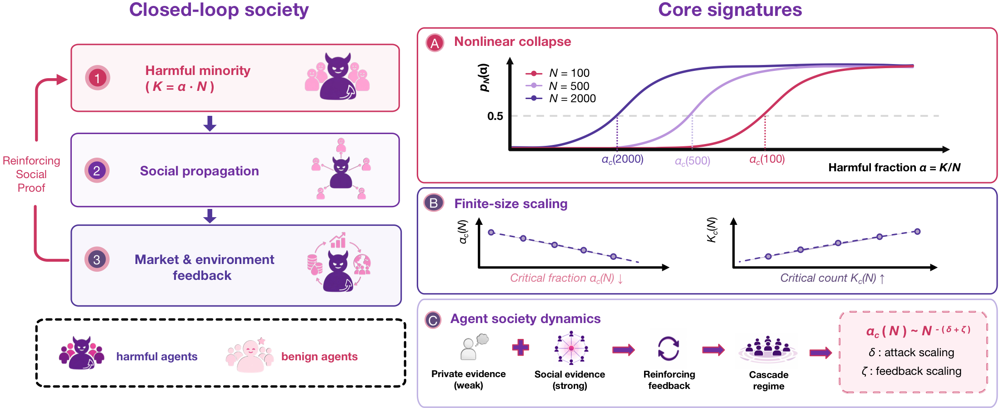

# WolfSociety

**Harmful-Agent Scaling and Collective Collapse in Financial Agent Societies**

[Project Page](https://zhanglejun02.github.io/when-harm-scales/) · [Paper](https://zhanglejun02.github.io/when-harm-scales/papers/when-harm-scales.pdf)

<p align="center">
  <a href="https://zhanglejun02.github.io/when-harm-scales/">
    
  </a>
</p>

WolfSociety studies how harmful-agent composition and society size shape
collective collapse in a controlled financial agent society. In the primary
scenario, the harmful fraction associated with a 50% failure probability falls
from 4.7% at 100 agents to 2.2% at 2,000 agents, while the corresponding harmful
count rises from approximately 5 to 44.

At a fixed harmful count, larger societies experience less severe disruption
under fixed, square-root, and per-capita liquidity scaling. Controlled
interventions further distinguish joint changes to the interaction setting
from individual components: broader network reach shifts the collapse boundary
toward lower harmful fractions, whereas stronger conformity alone has little
effect.

The repository contains the simulator, command-line tools, controlled scenarios,
and the experiment runners used for scaling, mechanism, and robustness studies.
The installable Python package and CLI retain the internal name `wolfbench`.

## Quick demo

After installation, run one deterministic 30-day episode:

```bash
wolfbench run --scenario s1 --alpha 0.02 --n-society 200 --seed 1
```

The command creates a society of 200 agents in the S1 social pump-and-dump
scenario, assigns 2% of them harmful behavior, and prints episode-level metrics
as JSON. Change `--alpha`, `--n-society`, or `--seed` to inspect a different
operating point.

For a small local collapse-boundary sweep:

```bash
wolfbench scaling \
  --scenario s1 \
  --alpha 0,0.02,0.05 \
  --n-society 100,200 \
  --seeds 2
```

## Environment setup

Python 3.10 or newer is required.

```bash
git clone https://github.com/SafeRL-Lab/WolfSociety.git
cd WolfSociety

python3 -m venv .venv
source .venv/bin/activate
python -m pip install --upgrade pip
python -m pip install -e ".[dev,plot]"
```

For experiments that call an OpenAI-compatible or OpenRouter model, install the
optional LLM dependencies as well:

```bash
python -m pip install -e ".[dev,plot,llm]"
export OPENROUTER_API_KEY="your-api-key"
```

The deterministic simulator and all commands using `--mock` run without an API
key. Mock runs validate the pipeline and artifact contract; they do not
reproduce the paper's LLM-derived numerical results.

## Run the project

List the available controlled scenarios:

```bash
wolfbench scenarios
```

Run a clean control and a harmful-agent episode:

```bash
wolfbench run --scenario s1 --alpha 0 --n-society 200 --seed 1
wolfbench run --scenario s1 --alpha 0.05 --n-society 200 --seed 1
```

Save one episode summary locally:

```bash
wolfbench run \
  --scenario s1 \
  --alpha 0.05 \
  --n-society 500 \
  --seed 1 \
  --out run.json
```

Evaluate a built-in defense over a small matched grid:

```bash
wolfbench evaluate \
  --defense rule \
  --scenario s1 \
  --alphas 0,0.02,0.05 \
  --n-society 200 \
  --seeds 1,2
```

The included scenarios cover a clean control, social pump-and-dump,
finfluencer scalping, spoofing/layering, and wash-trading/fake-liquidity
settings. They are controlled research environments, not production market
models.

## Run the experiments

Run commands from the repository root. Start with the deterministic integration
check before launching a larger experiment:

```bash
PYTHONPATH=src:. python -m paper_experiments_v3.experiments.p00_validate \
  --profile smoke \
  --mock \
  --quota-mode standard
```

Then run the main nonlinear-scaling experiment locally with the mock backend:

```bash
PYTHONPATH=src:. python -m paper_experiments_v3.experiments.p01_nonlinear_scaling \
  --profile smoke \
  --mock
```

The principal experiment runners are:

| Runner | Purpose |
| --- | --- |
| `p00_validate` | integration and clean-state sanity checks |
| `p01_nonlinear_scaling` | nonlinear response and finite-size scaling |
| `p02_size_decomposition` | fixed-count response and liquidity-scaling analysis |
| `p03_cross_scenario` | cross-scenario scope checks |
| `p04_game_phase` | interaction-condition and network-reach interventions |
| `p05_information_cascade` | private-to-social information balance |
| `p06_role_robustness` | role and behavioral-diversity robustness |

Every runner supports three execution scales:

- `--profile smoke`: minimal end-to-end check;
- `--profile pilot`: grid and protocol validation;
- `--profile paper`: full configured experiment.

Use `--mock` for deterministic local runs. Omit it only when the LLM dependency
and API credentials are configured. Local rows and frozen run configurations
are written under `paper_experiments_v3/outputs/` and are intentionally ignored
by Git.

Analyze a completed P01 run with:

```bash
PYTHONPATH=src:. python -m paper_experiments_v3.analysis.scaling \
  --run p01_nonlinear_scaling
```

See [paper_experiments_v3/EXPERIMENTS.md](paper_experiments_v3/EXPERIMENTS.md)
for the complete experiment registry and
[paper_experiments_v3/README.md](paper_experiments_v3/README.md) for runner and
analysis details.

## Tests

```bash
pytest -q
```

## Repository structure

```text
src/wolfbench/               simulator, scenarios, metrics, and CLI
paper_experiments_v3/        experiment runners and analysis code
tests/                       regression and integration tests
website/                     academic project page
```

Generated outputs, caches, figures, model weights, and manuscript sources are
not versioned.

## License

Released under the [Apache License 2.0](LICENSE).
