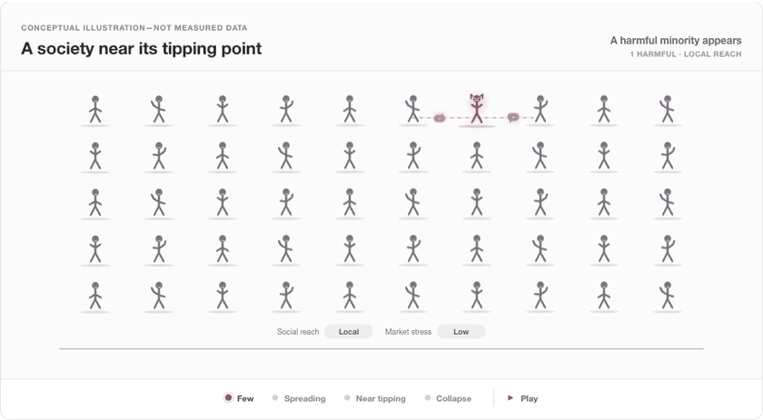
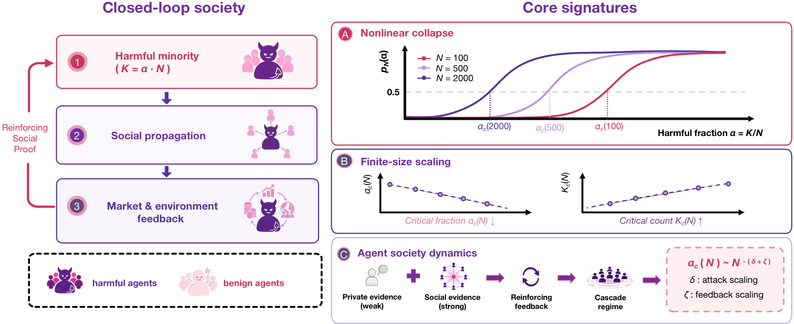

<p align="center">
  
</p>

<h1 align="center"><em>WolfSociety:</em> Understanding Collective Risk from Harmful-Agent Scaling in Financial Agent Societies</h1>

<p align="center">
  <a href="https://zhanglejun02.github.io/when-harm-scales/">Project Page</a> ·
  <a href="https://arxiv.org/html/2609.05591v1">Paper</a> ·
  <a href="#tutorial">Tutorial</a> ·
  <a href="#reproducing-the-paper-experiments">Experiments</a> ·
  <a href="#citation">Citation</a>
</p>

<p align="center">
  
  <a href="LICENSE"></a>
</p>

<p align="center">
  
</p>

<p align="center"><sub>A schematic view of harmful influence spreading through a growing society. The displayed society sizes and collapse-boundary values are measured results.</sub></p>

> **Disclaimer** This study is conducted solely for AI safety research. All harmful-agent behaviors are simulated to understand and mitigate collective risks, not to enable real-world financial harm. The controlled scenarios do not constitute financial or investment advice.

> **Full-LLM revision (October 2026):** New experiments use
> [`paper_experiments/`](paper_experiments/README.md) and the direct-decision
> vLLM runtime. The published figures and findings below describe the **previous
> hybrid implementation**. They have not been reproduced with the new policy.
> GPU execution instructions: [服务器运行手册 / Server runbook](SERVER_RUNBOOK.md).
> Historical experiments: [archive inventory](legacy_experiments/README.md).

## Overview

WolfSociety asks a simple but underexplored safety question: **as an agent
society grows, how does the harmful population required for collective failure
change?** We study this question in a controlled financial society where
agents communicate over a social network, trade in a shared market, and observe
the social and market conditions produced by earlier actions.

The repository provides **WolfBench**, the simulator and command-line toolkit
used in the study. It includes four manipulation scenarios, a clean control,
population-scaling experiments, controlled interventions, and analysis tools.
S1, the social pump-and-dump scenario, is the primary setting for the scaling
results.

<p align="center">
  <a href="https://zhanglejun02.github.io/when-harm-scales/">
    
  </a>
</p>

<p align="center"><sub>An overview of the setting, scaling results, and controlled interventions.</sub></p>

## Findings of the previous hybrid manuscript

- **Collapse appears abruptly.** In S1, collapse requires harmful information
  to spread broadly together with severe price dislocation or liquidity stress.
  Across all tested sizes, it changes from rare to frequent over a narrow range
  of harmful fractions.
- **The collapse boundary falls as society size grows.** The harmful fraction
  associated with a 50% collapse probability decreases from 4.7% at 100 agents
  to 2.2% at 2,000 agents. The corresponding harmful count rises from about 5
  to 44, but grows more slowly than the society itself.
- **The same harmful count has less impact in a larger society.** This result
  remains when total market depth is held fixed, grows with the square root of
  society size, or grows in direct proportion to it.
- **Reach matters more than conformity alone.** Allowing information to travel
  farther moves collapse toward lower harmful fractions. Making agents follow
  received social information more strongly has little effect on the boundary.

## What is included

| Component | What it provides |
| --- | --- |
| Simulator | Reproducible agent societies, social communication, trading, and episode-level metrics |
| Scenarios | Four manipulation settings—pump-and-dump, scalping, spoofing/layering, and wash trading—plus a clean control |
| CLI | Single episodes, scaling sweeps, and matched defense evaluation |
| Paper experiments | Scaling, size decomposition, interventions, cascade analysis, and robustness runners |
| Website | The academic project page and publication-ready figures |

## Tutorial

Python 3.10+ is required for the client. The GPU server uses a separate,
pinned vLLM environment; the client computer needs no GPU.

```bash
git clone https://github.com/SAIL-Research-Lab/WolfSociety.git
cd WolfSociety
python3 -m venv .venv
source .venv/bin/activate
python -m pip install -e '.[dev,plot]'
```

Run every retained experiment family with a small explicit mock population:

```bash
python -m paper_experiments.runner plan --mock --stage smoke --families all \
  --sizes 20 --seeds 9001 --horizon 3 --manifest runs/qa/manifest.json
python -m paper_experiments.runner run \
  --manifest runs/qa/manifest.json --output runs/qa
```

This checks integration and output formats. Mock outputs are marked and kept
separate from real model experiments; they cannot establish scientific results.

## Reproducing the paper experiments

The active suite retains the final main/appendix research questions and adds
language-content and benign/harmful controller contrasts. All population agents
in its main conditions decide orders, posts, reshares and challenges through
the LLM. Roles supply objectives/preferences, not precomputed actions. Matching,
budget limits, seeded graph delivery and evaluation remain environment code.
Pooled market liquidity is infrastructure outside the N population actors.

One model service handles all agents. Each agent retains its own portfolio,
inbox, observations and memory; all round decisions complete before settlement.
1000 agents over 30 rounds require 30,000 generations per episode, and 2000
require 60,000. Request failures stop the episode without a rule fallback.

```bash
# GPU server, in its vLLM environment; replace MODEL and revision for your setup.
MODEL=/srv/models/your-model SERVER_MANIFEST=runs/server.json \
  scripts/serve_vllm.sh

# Client, with that endpoint running. Plan only by default; EXECUTE=1 runs it.
EXECUTE=1 scripts/run_pilot.sh SERVED_MODEL WEIGHTS_REVISION runs/pilot-small \
  --families p01 --sizes 20,50,100 --seeds 1001 --horizon 5
```

Use the [server runbook](SERVER_RUNBOOK.md) for installation, real-prompt
1000/2000-agent throughput measurement, multi-GPU settings, grid refinement,
restart and full runs. The [experiment registry and analysis guide](paper_experiments/README.md)
map all main/appendix families, numerical controls and analysis tables.
New thresholds, exponents and intervention effects must be estimated from fresh
real-model pilots and independent main seeds. No old numeric result is reused.

Formal paper images are built with `scripts/build_paper_figures.sh` from explicit
completed real main runs. This rejects old/mock/pilot/incomplete evidence,
records per-image data/file hashes, and supports verifying the actual manuscript
PDF references. It calls the original publication plotting functions with the
new rows, preserving their layouts and style. It never calls the historical
data reader or fills missing results from old files.

The previous `wolfbench run/scaling/evaluate` CLI and
[`paper_experiments_v3/`](paper_experiments_v3/README.md) remain as deprecated
publication compatibility interfaces. They do **not** invoke the new
full-population runtime. Exploration and non-paper experiments are archived in
[`legacy_experiments/`](legacy_experiments/README.md), with original paths,
reasons and source hashes. Old local outputs are retained and ignored by Git.

## Tests

```bash
pytest -q
```

Tests cover the round barrier, population coverage, direct decisions, textual
inboxes, resource constraints, backend errors, transport/retry behavior,
experiment manifests and analysis. CPU mock/fake-server tests exercise the
protocol; real vLLM model behavior and GPU throughput require a server pilot.

## Repository structure

```text
src/wolfbench/llm_runtime/   active direct-decision policy, vLLM client, language routing
src/wolfbench/env/           deterministic market/social mechanisms and evaluation
paper_experiments/           active main/appendix registry, manifests, grids, analyses
scripts/                    vLLM launch, throughput benchmark, pilot and main runners
SERVER_RUNBOOK.md            GPU execution instructions (Chinese)
legacy_experiments/          archived exploration and historical analyses
paper_experiments_v3/        deprecated publication compatibility baseline
tests/                      regression and integration tests
website/                    project page for the previous manuscript
```

Generated results, prompts/responses, caches, model weights and credentials are
not versioned. Scientific run bundles should be archived separately with their
manifests, compressed traces, model revision and GPU server configuration.

## Citation

If WolfSociety is useful in your research, please cite:

```bibtex
@unpublished{zhang2027wolfsociety,
  title  = {{WolfSociety}: Understanding Collective Risk from Harmful-Agent Scaling in Financial Agent Societies},
  author = {Zhang, Lejun and Lu-Liang, Sarah and Jiang, Xin and Wen, Muning and Zhang, Weinan and Gu, Shangding},
  Journal   = {Arxiv},
  year   = {2026}
}
```

## License

Released under the [Apache License 2.0](LICENSE).
